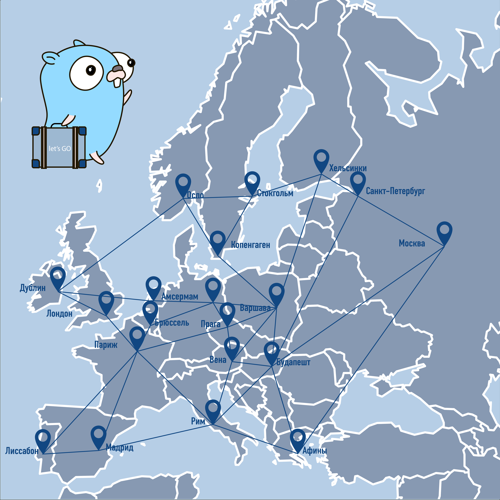

# Гофер гонки



Нужно накодить самую быстрое решение, которое поможет гоферу пройти весь маршрут максимально быстро. Для этого нужно правильно распарсить 
список маршрутов и найти крадчайший путь. Список маршрутов в таком формате:

```
A - 3 - B
A - 2 - C
A - 4 - E
B - 8 - C
C - 1 - D
E - 3 - B
```

Полное список находится в файле `routes`. Его нужно прочитать и распарсить.

## Задача

Вам нужно построить максимально короткий маршрут от точки `A` до точки `D` за максимально короткое время

Весь ваш код должен быть в файле `faster_car.go`

Для запуска тестов используем команду:

```
go test -bench=. -v
```

## Как отправлять решения

Нужно форкнуть репозиторий и свои решения оформлять в виде пулл-реквеста. Тревис автоматически запустит тесты и бенчмарки. Результаты можно посмотреть тут: https://travis-ci.org/techtrain-go/race/builds
